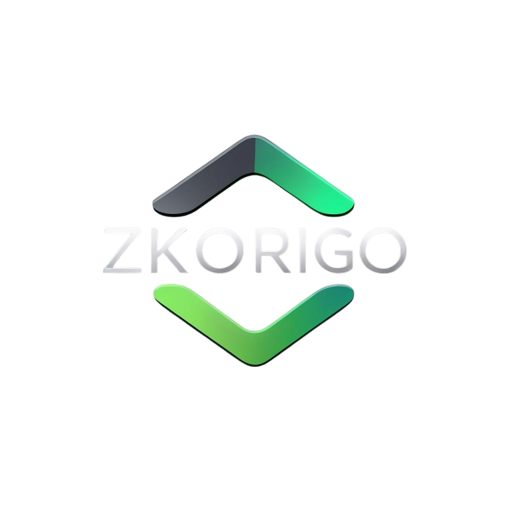

# zkOrigo – Multi-Chain Stateless Validator

<p align="center">
  
</p>

[](https://sonarcloud.io/summary/new_code?id=ADCoinX_zkOrigo)
[](https://sonarcloud.io/summary/new_code?id=ADCoinX_zkOrigo)
[](https://sonarcloud.io/summary/new_code?id=ADCoinX_zkOrigo)

---

## 🔎 Overview

zkOrigo is a **stateless, multi-chain wallet validator** that provides:

- AI-driven risk scoring (Heuristic v2).  
- Stateless validation – no private keys, no funds, no sensitive data stored.  
- ISO 20022 XML export (audit-ready format trusted by banks).  
- zk-Proof hash generation (future upgrade to circom/snarkjs).  
- Multi-chain fallback RPC endpoints for reliability.  

This approach delivers **compliance + risk visibility** for enterprises, RWA projects, and regulators.

---

## 🌐 Live Demo

👉 [zkOrigo MVP](https://zkorigo.onrender.com)

---

## 🏗️ Supported Chains

- Ethereum (ETH)  
- Polygon (MATIC)  
- Binance Smart Chain (BNB)  
- Solana  
- XRPL  
- Hedera  
- Stellar (XLM)  

Each chain integrates **3 fallback RPC endpoints** to guarantee high availability.

---

## 🛡️ InfoSec Architecture

```mermaid
flowchart TD
    User[Wallet Address] --> |Submit| Validator[zkOrigo Stateless Validator]
    Validator --> |Query| RPC[(Public RPC Fallbacks)]
    Validator --> |AI Heuristic v2| Risk[Risk Scoring Engine]
    Validator --> |Generate| ISO[ISO20022 XML Export]
    Validator --> |Produce| Proof[zk-Proof Hash (dummy → circom/snarkjs)]
    ISO --> |Download| Report[Audit Report]
    Proof --> Report
```

	•	Stateless design: No keys, no storage, only public blockchain data.
	•	AI module: Heuristic-based scoring v2 (entropy check, endpoint fallback, dormant wallet detection).
	•	Compliance: ISO20022 pain.001 export.
	•	Quality Assurance: SonarCloud Quality Gate Passed.

⸻

📂 Project Structure

/app.py              → FastAPI main app  
/chains.py           → Multi-chain RPC + balance checker  
/ai_module.py        → Heuristic AI risk scoring (v2)  
/iso_export.py       → ISO20022 XML export (pain.001)  
/zk_proof.py         → Dummy zk-proof generator  
/rwa_module.py       → RWA Proof generator  
/templates/          → Jinja2 templates  
/static/             → CSS, logos, UI assets  
/outputs/            → Generated ISO20022 XML reports  


⸻

📊 Traction
	•	3,500+ wallet validations across zkOrigo, HGuard, ProetorX, and CryptoGuard.
	•	Multiple grant programs in due diligence / shortlisted (Hedera, XRPL, Thrive).
	•	Positive recognition from Ripple VP on LinkedIn.
	•	Published thought leadership: Medium – Blockchain is Broken Without Compliance.

⸻

📅 Roadmap
	•	M1 – MVP live (multi-chain stateless validation + heuristic AI v2).
	•	M2 – Full balance + transaction analysis integration.
	•	M3 – Advanced ISO20022 mappings (pain.001 + pacs.008).
	•	M4 – Upgrade zk-Proofs (dummy → circom/snarkjs).
	•	M5 – Enterprise integrations & RWA pilot deployments.

⸻

⚠️ Disclaimer

This validator is for informational and compliance purposes only.
	•	No private keys are collected.
	•	No funds are accessed or moved.
	•	Only public blockchain data is queried, validated, and exported.
	•	Final decisions remain with the end user.
